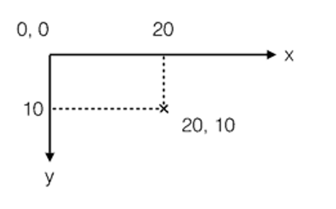

# 前端动效技术

## css3动效技术:

```
1. transform 转换

translate(x,y)	
scale(x,y)	
rotate(angle)	
skew(x-angle,y-angle)	

2. transition 过渡

transition: property duration timing-function delay;

3. animation 动画

animation: name duration timing-function delay iteration-count(n/infinite) direction(alternate);

@keyframes name
{
from {}
to {}
}

@keyframes name
{
0% {}
100% {}
}

```

=> [translate](http://www.w3school.com.cn/tiy/c.asp?f=css_transform_translate)
=> [scale](http://www.w3school.com.cn/tiy/c.asp?f=css_transform_scale)
=> [rotate](http://www.w3school.com.cn/tiy/c.asp?f=css_transform_rotate)

=> [transition](http://www.w3school.com.cn/tiy/t.asp?f=css3_transition)

=> [animation](http://www.w3school.com.cn/tiy/t.asp?f=css3_animation)


##  实例



##### => [外链跳转](https://api-m.haohuan.com/public/h5/externalChainSkip.html?url=https%3A%2F%2Fwww.haohuan.com%3Ftest%3D1)

## 更强大的绘图技术

ECharts 支持以 Canvas、SVG（4.0+）、VML 的形式渲染图表。VML 可以兼容低版本 IE，SVG 使得移动端不再为内存担忧，Canvas 可以轻松应对大数据量和特效的展现。不同的渲染方式提供了更多选择，使得 ECharts 在各种场景下都有更好的表现。

## canvas

Canvas是HTML5新增的组件，它就像一块幕布，可以用JavaScript在上面绘制各种图表、动画等。

没有Canvas的年代，绘图只能借助Flash插件实现，页面不得不用JavaScript和Flash进行交互。有了Canvas，我们就再也不需要Flash了，直接使用JavaScript完成绘制。

一个Canvas定义了一个指定尺寸的矩形框(画布)，在这个范围内我们可以随意绘制

##### => [圣诞活动](http://api-m.haohuan.com/public/activity/ChristmasDay.html)

##### => [精彩介绍](https://www.imooc.com/video/2493)

## canvas 特点

##### 特点

1. html5图形标签

1. 只是容器,相当于提供了一个画布

1. 需要脚本来绘制图形

1. 依赖 api

##### 与 SVG 区别

1. canvas 依赖 api 绘图

1. svg 依赖 xml 文档描述绘图

## 画布

一个Canvas定义了一个指定尺寸的画布，在这个范围内我们可以随意绘制：
```
<canvas id="test-canvas" width="300" height="200"></canvas> 
```
由于浏览器对HTML5标准支持不一致，所以，通常在canvas内部添加一些说明性HTML代码，如果浏览器支持Canvas，它将忽略canvas内部的HTML，如果浏览器不支持Canvas，它将显示canvas内部的HTML：

```
<canvas id=“test-stock” width=“300” height=“200”> <p>不支持</p> </canvas> 
```
## Canvas 坐标系

我们可以在Canvas上绘制各种形状。在绘制前，我们需要先了解一下Canvas的坐标系统：

Canvas的坐标以左上角为原点，水平向右为X轴，垂直向下为Y轴，以像素为单位，所以每个点都是非负整数

## 常用api

```
getContent
clearRect
srtoke
fill
drawImage
```


## 绘图实例

```

var canvas = document.getElementById('test-shape-canvas'), ctx = canvas.getContext('2d'); 

ctx.clearRect(0, 0, 200, 200); // 擦除(0,0)位置大小为200x200的矩形，擦除的意思是把该区域变为透明
ctx.fillStyle = '#dddddd'; // 设置颜色
ctx.fillRect(10, 10, 130, 130); // 把(10,10)位置大小为130x130的矩形涂色
// 利用Path绘制复杂路径:
var path=new Path2D();
path.arc(75, 75, 50, 0, Math.PI*2, true);
path.moveTo(110,75);
path.arc(75, 75, 35, 0, Math.PI, false);
path.moveTo(65, 65);
path.arc(60, 65, 5, 0, Math.PI*2, true);
path.moveTo(95, 65);
path.arc(90, 65, 5, 0, Math.PI*2, true);
ctx.strokeStyle = '#0000ff';
ctx.stroke(path);


```

## 实例(缩略图生成)

画布保存

- toDataUrl

##### => [利用canvas缩略图片:](http://jxjweb.top/2017/03/27.html)


## 实例(小游戏)

动画原理:

- 绘制画布

- 清空画布

##### => [小游戏](https://jxj322991.github.io/jump-game/play.html)

## 技术展示

##### => [codepen](https://codepen.io/)

##### => [echarts](http://echarts.baidu.com/index.html)

## 肖健
## 2018/12/23
